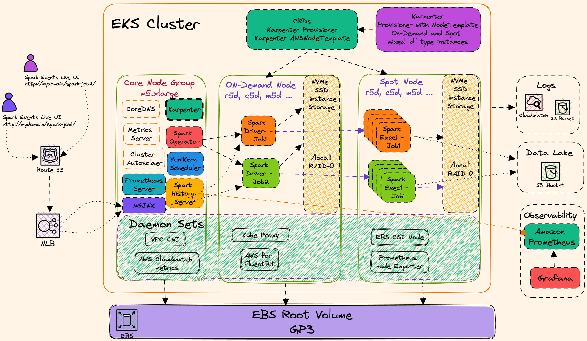

# ngap-eks-spark
The EKS Cluster design for the Data on EKS blueprint is optimized for running Spark applications with Spark Operator and Apache YuniKorn as the batch scheduler. This blueprint shows both options of leveraging Cluster Autoscaler and Karpenter for Spark Workloads. AWS for FluentBit is employed for logging, and a combination of Prometheus, Amazon Managed Prometheus, and open source Grafana are used for observability. Additionally, the Spark History Server Live UI is configured for monitoring running Spark jobs through an NLB and NGINX ingress controller.

**_Key Components:_**
* **Spark Operator:** A Kubernetes operator for managing Spark applications. 
* **Apache YuniKorn:** A batch scheduler for Apache Spark that provides fairness, elasticity, and isolation of workloads.
* **Cluster Autoscaler:** An autoscaler for Kubernetes clusters that automatically adjusts the number of nodes based on resource requirements.
* **Karpenter:** A tool for provisioning and managing Kubernetes clusters on AWS.
* **AWS for FluentBit:** A fully managed logging solution for AWS that collects, processes, and forwards logs to Amazon CloudWatch.
* **Prometheus:** An open-source monitoring system that collects metrics from containers.
* **Amazon Managed Prometheus:** A fully managed Prometheus service on AWS.
* **Grafana:** An open-source data visualization tool that can be used to visualize metrics collected by Prometheus.
* **NLB (Network Load Balancer):** A load balancing service on AWS that distributes traffic across multiple nodes.
* **NGINX Ingress Controller:** An ingress controller for Kubernetes that manages incoming traffic to the cluster.

**_Benefits:_**

* **High Performance:** The EKS Cluster design is optimized for running Spark applications, which can handle large-scale data processing tasks efficiently.
* **Elasticity:** The Cluster Autoscaler and Karpenter tools can automatically scale the cluster up or down based on demand, ensuring that resources are always available to meet the needs of Spark applications.
* **Observability:** The combination of Prometheus, Amazon Managed Prometheus, and Grafana provides comprehensive observability into the health and performance of the cluster and Spark applications.

**_Use Cases:_**
* **Data Warehousing:** The EKS Cluster design is ideal for building data warehouses that can store and analyze large amounts of data.
* **Machine Learning:** The EKS Cluster design can be used to build machine learning pipelines that process and train large datasets.
* **Real-time Data Processing:** The EKS Cluster design can be used to process and analyze data in real time, such as for fraud detection or anomaly detection.

